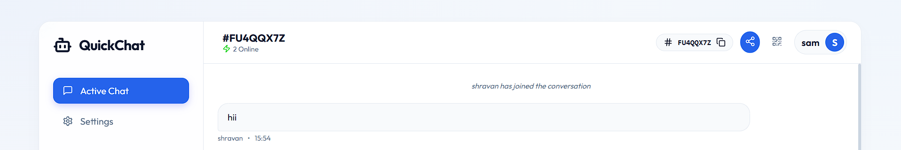
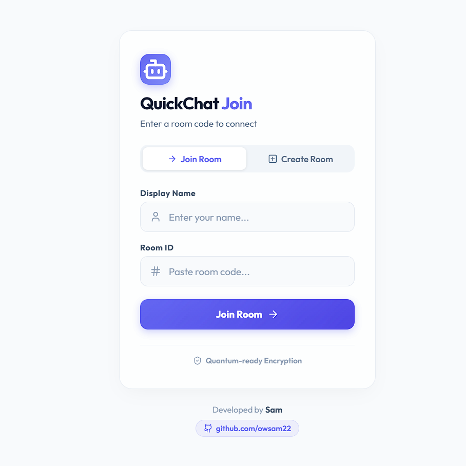

<!-- ===================================================== -->
<!--                    GLOWCHAT README                   -->
<!-- ===================================================== -->

<p align="center">
  
</p>

<h1 align="center">✨ QuickChat</h1>
<h3 align="center">Instant. Anonymous. Real-Time Event Chat.</h3>

<p align="center">
  
  
  
  
</p>

<p align="center">
  <strong>No Login • No Phone Number • No Friction</strong><br/>
  Built for seminars, workshops, hackathons, and instant collaboration.
</p>

---

## 🚀 Live Demo

🔗 https://owsam-quickchat.vercel.app/

---

# 🎯 What is QuickChat?

QuickChat is a **temporary, anonymous real-time chat platform** designed for live events.

Create a room.  
Display the QR.  
Participants join instantly.  
Room closes automatically when everyone leaves.

No accounts.  
No stored messages.  
No long-term data retention.

---

# 🖼️ Preview

<p align="center">
  
</p>

---

# ✨ Core Features

## ⚡ Instant Anonymous Join
- Users choose their own display name
- Duplicate names prevented inside a room
- No authentication required

## 📲 QR Code Access
<p align="center">
  
</p>

- Scan and join instantly
- Optimized for projector-based seminars
- Mobile-friendly experience

## 💬 Real-Time Messaging
- Powered by Socket.IO
- Instant delivery
- Join/leave system notifications
- Auto-scroll behavior
- Room auto-closes when empty

## 🎨 Premium Glassmorphism UI
- Blur + glass effect
- Modern gradient glow accents
- Clean, minimal layout
- Fully responsive

## 🧹 Automatic Room Lifecycle
- No persistence
- Temporary by design
- Auto cleanup when last user exits

---

# 🛠 Tech Stack

### Frontend
- React
- Vite
- socket.io-client

### Backend
- Node.js
- Express
- Socket.IO

---

# 📂 Project Structure

```
GlowChat/
├── backend/
│   ├── server.js
│   └── package.json
├── frontend/
│   ├── src/
│   └── package.json
├── assets/
│   ├── banner.png
│   ├── preview.png
│   ├── qr-demo.gif
│   └── watermark.png
```

---

# ⚙️ Local Installation

## 1️⃣ Clone Repository

```bash
git clone https://github.com/owsam22/chat-room.git
cd chat-room
```

## 2️⃣ Start Backend

```bash
cd backend
npm install
npm run dev
```

Backend runs at:
```
http://localhost:5000
```

## 3️⃣ Start Frontend

Open new terminal:

```bash
cd frontend
npm install
npm run dev
```

Frontend runs at:
```
http://localhost:3000
```

---

# 🧪 How to Test

1. Open `http://localhost:3000`
2. Enter username
3. Create or join a room
4. Open second tab/browser
5. Join same room with different name
6. Start chatting instantly

---

# 🔐 Design Philosophy

GlowChat is built around:

- 🚫 No accounts
- ⚡ Instant access
- 🧹 Temporary collaboration
- 🔒 Privacy by default

It is not trying to replace large messaging platforms.  
It is built specifically for **short-lived live interactions.**

---

# 🚧 Upcoming Features

- Host controls (mute, kick, lock room)
- Live polls
- Q&A mode
- Spam protection & rate limiting
- Message length restriction
- Export chat option

---

# 📈 Vision

GlowChat aims to become a lightweight browser-based interaction tool for:

- 🎓 College seminars
- 🧑‍💼 Corporate workshops
- 💡 Hackathons
- 📢 Live events

Focused. Fast. Disposable.

---

# 🏷️ Branding

<p align="center">
  
</p>

Built with precision by SAM

---

# 📄 License

MIT License